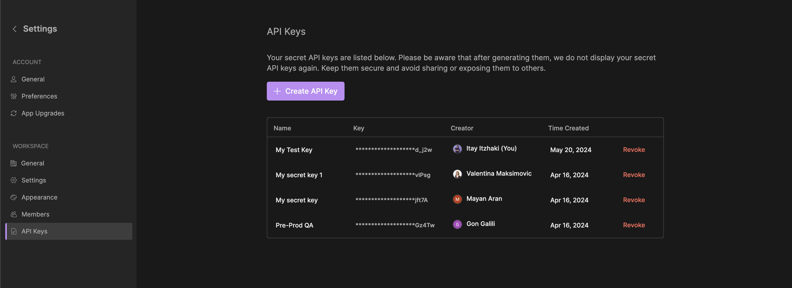

# Unleash Platform APIs

Unleash Platform APIs enable customers to programmatically access some of the core functionalities of the Unleash platform. the API is currently limited only for performing search and AI question answering. On our roadmap we plan to expand the API to support complete management of wikis, go links, connections, assistants, etc…

For the API swagger documentation please refer to: [https://api.unleash.wiki](https://api.unleash.wiki/)

In this document we cover some basic concepts of the API plus some guidelines on how to use our JS SDK.

## Installation

```bash
npm install @unleash-tech/platform-sdk
```

## Quick Start

the following simple code will perform a search on behalf of “myuser” using the default assistant 

```jsx
var unleash = require('@unleash-tech/platform-sdk')

var client = 
    new unleash.ApiClient({
        token:'<mytoken>',
        account:'myuser@acme.com'
    });

var assistant = client.assistants.default;

var response = await assistant.search({
    query:'how to use go links',
    filters:{appId:['notion']}
})
```

## Authentication

The Unleash Platform APIs are protected using Bearer Tokens. Tokens can be created by admin users only from the api keys page in the settings section of the Unleash console.



Api Tokens in Unleash are not bounded to a specific user but attached globally to the organization workspace. Hence, whenever invoking an API , a user account must also be specified explicitly via the ‘unleash-account’ header (or the ‘account’ field of ApiClientOptions in the SDK). 

## Errors

Every endpoint of the platform API returns a RequestId field in the body and header of the response.  in case you encountered an unexpected error you could provide the Requestid value to our support team to further diagnose the root cause of the error. Errors in the API follows  standardised REST errors format (**RFC 7807**)

## Assistants

In order to perform a search or answer a question using AI an assistant must be chosen. You can either choose to use the default assistant (e.g. the search experience of Unleash own search page)  or a specific assistant

```jsx
var assistant = client.assistants.default;
var myAssistant = client.assistants.withId('<assistant id>')
```

To create an assistant that can be used via the API go to the assistants page on the unleash console and create a new general assistant


Proceed to configure the assistant behavior and data sources and save the changes


Upon saving the assistant id will be available in the url of the page, the last fragment


There are four main methods which an assistant expose:

- search - returns the actual resources that matches a certain user query
- answer - generate an ai answer for a user question
- filters - return the set of supported filters for the assistant based on the actual data sources that it has access to
- filterValues - return the set of filter values that are supported for a given filter (e.g. for the appId filter it will return values such as: ‘notion’, ‘confluence’, etc..)

for the full description of those endpoints contracts refer to the swagger api